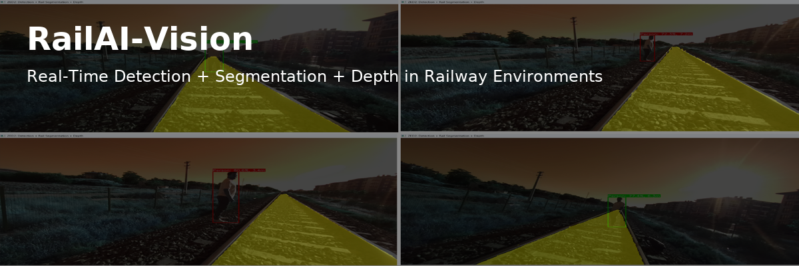

<p align="center">
  
</p>
<h1 align="center">RailAI-Vision: Real-Time Railway Environment Perception Framework</h1>
<p align="center">
  <em>Multitask Deep Learning for Safety-Critical Railway Perception</em>
</p>
<p align="center">
  
  
  
  <a href="https://deepwiki.com/AmerJabban1/RailAI-Vision" target="_blank">
  </a>


</p>

---

**RailAI-Vision** is a modular, multitask deep learning framework designed for object detection, semantic segmentation, and depth estimation in railway environments. It integrates real-time safety perception using camera-based vision — suitable for research, prototyping, and industrial applications.

- Samples of system output with the ZED2 camera.

- Samples of system output with the MiDaS.


---

## 📌 Key Features

✅ Real-time object detection (YOLOv11)  
✅ Semantic segmentation of railway track (DeepLabV3+)  
✅ Depth estimation via stereo camera (ZED2) or MiDaS  
✅ Fusion of detection + segmentation + distance  
✅ Modular, scalable, and ready for experimentation  
✅ Supports training, evaluation, and inference workflows

---
 
## 🧱 Project Structure
```
RailAI-Vision/
├── detection/              # Object detection with YOLO and Faster R-CNN
├── segmentation/           # Railway track segmentation with DeepLabV3+ and UNet
├── depth/                  # Detection + segmentation + depth fusion
├── fusion/                 # Detection + segmentation (without depth)
├── datasets/               # Dataset preparation scripts and configs
└── README.md               # This file
```

---


## 🔍 Modules Overview

| Module          | Purpose                                      | Techniques Used                              |
|-----------------|----------------------------------------------|----------------------------------------------|
| `detection/`    | Train and run object detectors (YOLO, FRCNN) | YOLOv11, Faster R-CNN (PyTorch, Ultralytics) |
| `segmentation/` | Train and run semantic segmentation models   | DeepLabV3+, UNet (Torchvision, custom)       |
| `fusion/`       | Fuse detection + segmentation                | Track-aware fusion logic                     |
| `depth/`        | Fusion + depth measurement                   | ZED2 stereo or MiDaS depth inference         |

---

## 📷 Use Cases

- 🚉 **Railway Obstacle Detection**
- 🚦 **Traffic Sign & Signal Recognition**
- 👷 **Human/Worker Detection**
- 📏 **Rail Track Awareness & Distance Estimation**

---

## ⚙️ Requirements

Install core dependencies:

```bash
pip install -r requirements.txt
``` 

Additional for ZED2 camera support:
[Install ZED SDK](https://www.stereolabs.com/docs/installation) 

---

## 📁 Dataset Support
This project is compatible with:

- RailSem19 dataset for segmentation
- Custom-labeled detection datasets (YOLO/FRCNN format)

Dataset configs and instructions are inside each module.

---

## 📊 Results & Performance

| Task             | Model      | Accuracy  | Inference FPS  | Notes                   |
|------------------|------------|-----------|----------------|-------------------------|
| Detection        | YOLOv11n   | \~51%     | >30 FPS        | Real-time               |
| Segmentation     | DeepLabV3+ | \~77% IoU | 20–25 FPS      | Rail track segmentation |
| Depth Estimation | MiDaS/ZED2 | N/A       | \~20 FPS (ZED) | Monocular or stereo     |

**Note:** Detailed metrics, confusion matrices, and visual results are saved in each module's `results/` directory.

---

## 🧪 Quick Start
### 🔹 Object Detection
```bash
cd detection
python scripts/train.py --config configs/yolov11.yaml
``` 
### 🔹 Segmentation
```bash
cd segmentation
python scripts/train.py --config configs/deeplabv3plus.yaml
``` 
### 🔹 Fusion (Detection + Segmentation)
```bash
cd fusion
python scripts/infer.py --image inputs/sample.jpg
``` 
### 🔹 Depth Fusion (ZED2 or MiDaS)
```bash
cd depth
python scripts/run_depth_fusion_zed.py        # Real-time
python scripts/run_depth_fusion_midas.py      # Offline
``` 

---

## 📄 Citation
This framework is part of my Master's thesis and scientific research efforts.
If you use this work in your research, please cite the following paper:
> M. A. Elmuhammedcebben, İ. Aydın, and M. Sevi, “Demiryolu Ortamında Nesne Tespiti için Derin Öğrenme Yöntemlerinin Geliştirilmesi ve Zed Kamerası ile Mesafe Ölçümü,” Railway Engineering, no. 22, pp. 10–24, Jul. 2025, doi: 10.47072/DEMIRYOLU.1645019.
- BibTeX format:
```
@article{elmuhammedcebben2025rail,
  title={Demiryolu Ortamında Nesne Tespiti için Derin Öğrenme Yöntemlerinin Geliştirilmesi ve Zed Kamerası ile Mesafe Ölçümü},
  author={Elmuhammedcebben, M. A. and Aydın, İ. and Sevi, M.},
  journal={Railway Engineering},
  number={22},
  pages={10--24},
  year={2025},
  doi={10.47072/DEMIRYOLU.1645019}
}
```

---

## 🪪 License

This codebase is licensed for **non-commercial academic use only**. For commercial licensing or collaborations, please contact the author.

---


## 🤝 Contributions & Acknowledgments

Pull requests, feedback, and collaborations are welcome!

Developed with ❤️ for real-time railway safety and perception research.

This project builds upon open-source contributions from:

- [Ultralytics YOLO](https://docs.ultralytics.com/)
- [Torchvision Semantic Segmentation](https://github.com/qubvel-org/segmentation_models.pytorch)
- [Intel ISL MiDaS](https://github.com/isl-org/MiDaS)
- [ZED SDK](https://github.com/stereolabs/zed-sdk)

---

## 📬 Contact
For questions or collaboration opportunities, feel free to reach out via [LinkedIn](https://www.linkedin.com/in/amerjabban1/).

---
