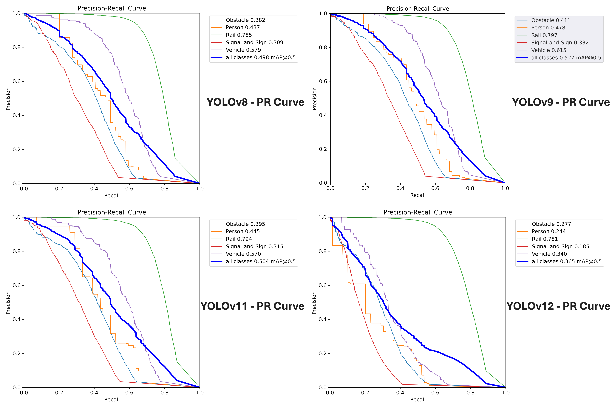
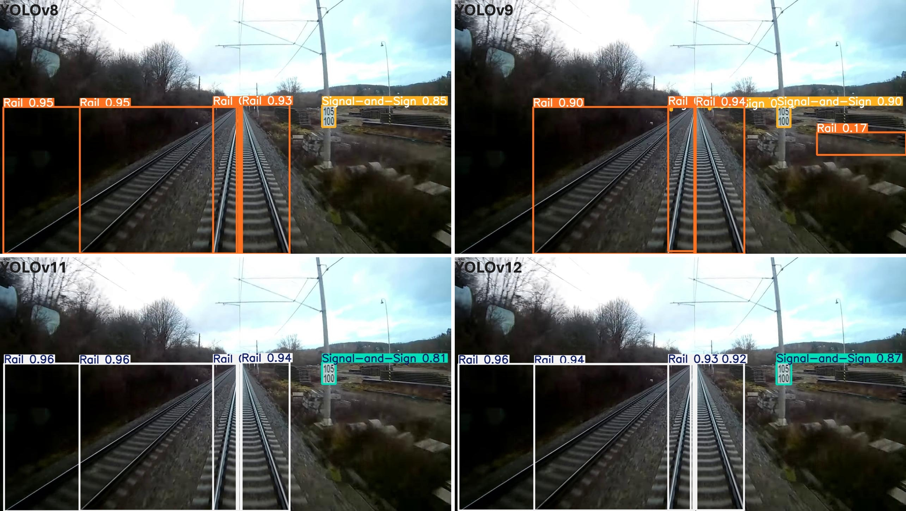

# RailAI-Vision: Deep Learning-Based Object Detection in Railway Environments (YOLO & Faster R-CNN, RailSem19)

This module contains pipelines for object detection in railway environments using multiple deep learning architectures, including **YOLOv8**, **YOLOv9**, **YOLOv11**, **YOLOv12**, and **Faster R-CNN**. Developed as part of a research project focused on enhancing railway safety through vision-based perception, the system supports both training from scratch and inference with pretrained models.

---

## 📁 Folder Structure

```
detection/
├── configs/                # YAML configuration files for each model (training setup)
├── datasets/               # Local dataset in YOLO format (train/val/test + data.yaml)
├── scripts/                # Unified training, validation, and prediction scripts
│ ├── train.py              # General YOLO training
│ ├── val.py                # YOLO evaluation
│ ├── predict.py            # YOLO inference
│ └── train_fasterrcnn.py   # Faster R-CNN training
├── utils/
│ ├── dataset.py            # Faster R-CNN dataset loader
│ ├── engine.py             # Faster R-CNN training engine
│ └── utils.py              # Logging, saving, helpers
├── weights/                # Pretrained model weights (.pt/.pth)
├── results/                # Evaluation outputs: confusion matrices, prediction samples, metrics
├── requirements.txt        # Dependencies for the detection module
└── README.md               # Documentation and usage guide
```

---

## 🧰 Environment

- Python ≥ 3.8
- Torch ≥ 2.0.0
- GPU with CUDA ≥ 11.7 recommended (for training)

---

## ⚙️ Installation

```bash
cd detection
pip install -r requirements.txt
```

---

## 📚 Configuration

Each model has its own configuration file located in `configs/`, containing:
- Path to the model architecture or pretrained weights
- Training parameters (epochs, batch size, image size, etc.)
- Path to the `data.yaml` file

Example: `configs/yolov11.yaml`
Each configuration controls model-specific settings and can be passed as `--config` to all training/validation/inference scripts.


```yaml
model_architecture: yolov11s.pt
data_yaml: ./datasets/data.yaml
epochs: 50
imgsz: 640
batch: 16
device: 0
project: ./runs/train
name: yolov11
```

---

## 🚀 Usage
### 🔷 YOLO Models (YOLOv8, v9, v11, v12)
All YOLO models use the same script interface. Each one has a config in configs/.

#### 🏋️‍♂️ Training

```bash
python scripts/train.py --config configs/yolov11.yaml
```

This command will train the selected model using the specified configuration.

---

#### 🧪 Validation

```bash
python scripts/val.py \
  --model weights/yolov11.pt \
  --data datasets/data.yaml
```

This will evaluate the model on the validation split, providing metrics like mAP, precision, recall, and generating a confusion matrix.

---

#### 🔍 Inference

```bash
python scripts/predict.py \
  --model weights/yolov11.pt \
  --source datasets/test/images \
  --conf 0.25
```

By default, results are saved under the `runs/detect/predict/` directory. You can customize the `--save-dir` argument if needed.

---

### 🔶 Faster R-CNN
Trained using PyTorch’s torchvision.models.detection.

#### 🏋️‍♂️ Training
```bash
python scripts/train_fasterrcnn.py --config configs/fasterrcnn.yaml
```

Internally uses dataset.py, engine.py, and utils.py to handle training loop and logging.

---

## 📊 Dataset Format

The dataset is organized in the standard YOLO format:

```
datasets/
├── train/
│   ├── images/
│   └── labels/
├── valid/
│   ├── images/
│   └── labels/
├── test/
│   ├── images/
│   └── labels/
└── data.yaml
```

Example `data.yaml`:

```yaml
train: ./datasets/train/images
val: ./datasets/valid/images
test: ./datasets/test/images

nc: 5
names: ['Obstacle', 'Person', 'Rail', 'Signal-and-Sign', 'Vehicle']
```

---

## 🧠 Pretrained Weights

The `weights/` directory contains pretrained `.pt` files for each model. To use a pretrained model directly for inference:

```bash
python scripts/predict.py --model weights/yolov8.pt --source datasets/test/images
```

If training is skipped, you can still use pretrained weights available in the `weights/` folder for inference.

---

## 📈 Output

Results from each model, including confusion matrices, training plots, and prediction samples, are stored in the `results/` directory.

### 🔎 Example Detection Output




---

## 📝 Notes
- ✅ All models trained on RailSem19 with 5 custom classes
- 🧩 Modular scripts support easy extension and experimentation
- 🖥️ Designed for reproducible local execution (no cloud dependencies)
- 🔁 Supports training from scratch or using pretrained weights
- ⚡ Works with CPU and GPU (CUDA) environments

---

## 📚 Acknowledgments

- [Ultralytics YOLO](https://github.com/ultralytics/ultralytics)
- [TorchVision Models](https://docs.pytorch.org/vision/main/models.html)
- [RailSem19 Dataset](https://www.wilddash.cc/railsem19)

---