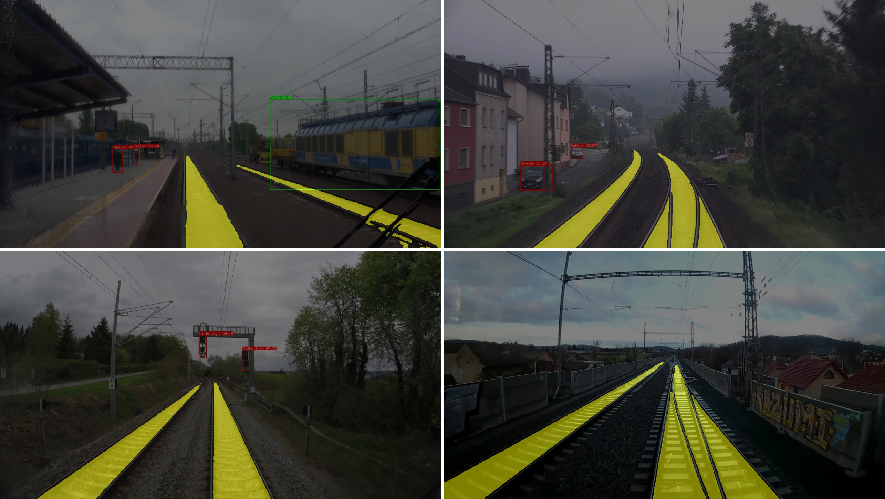
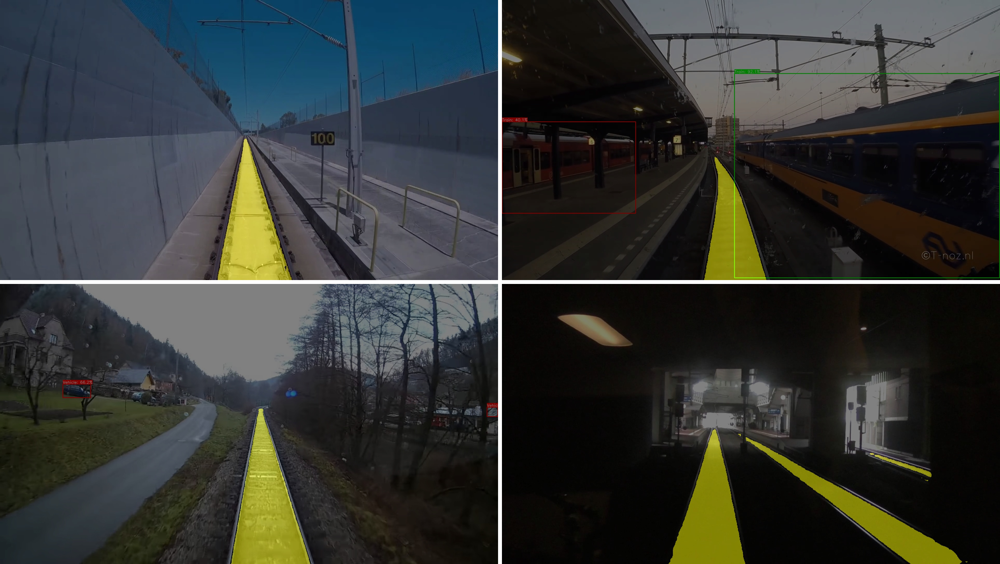
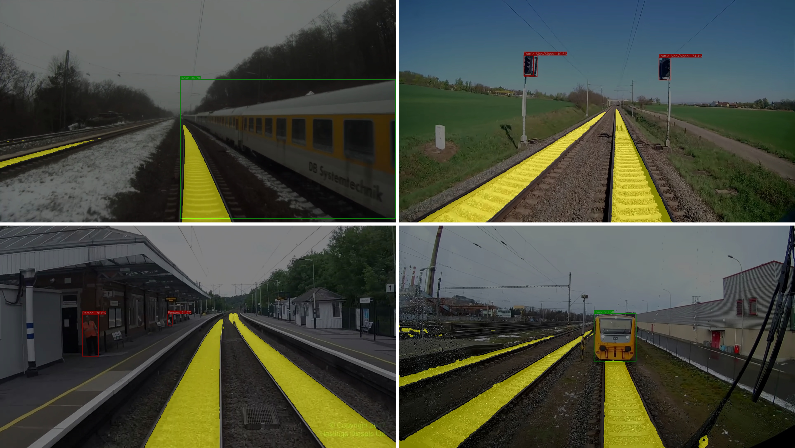

# 🔗 RailAI-Vision: Fusion Module

This module performs **fusion between semantic segmentation and object detection** in railway environments. It is designed to highlight detected objects based on their spatial relationship with the railway tracks, enabling intelligent decision-making in rail safety systems.

Developed using **YOLOv11** for object detection and **DeepLabV3+** for segmentation, this pipeline overlays detections on semantic maps and **colors bounding boxes**:
- 🟩 **Green**: Object intersects with railway track (e.g., person or obstacle *on track*)
- 🟥 **Red**: Object is detected *off track*

---

## 📁 Folder Structure
```
fusion/
├── scripts/
│ └── run_fusion.py                 # Main fusion script
├── engine.py                       # Fusion logic (mask intersection, annotation, saving)
├── models/
│ ├── loader.py                     # Loads YOLOv11 and DeepLabV3+ models
│ └── utils.py                      # Utility functions for preprocessing, IO, and masks
├── utils/
│ └── visualization.py              # Drawing masks, bounding boxes, overlays
├── results/                        # Evaluation outputs: confusion matrices, prediction samples, metrics
├── requirements.txt                # Dependencies for the detection module
└── README.md                       # Documentation and usage guide
```

---


## ⚙️ Installation

Install dependencies (YOLO, torchvision, segmentation_models_pytorch, etc.):

```bash
pip install -r ../requirements.txt
```

---

## 🧠 Models
- YOLOv11: Used for detecting objects like person, vehicle, etc.
- DeepLabV3+: Used for pixel-wise segmentation (e.g., rail-track)

Both models are loaded using:
```bash
from models.loader import load_detection_model, load_segmentation_model
```

---

## 🚀 How to Run Fusion
```bash
python scripts/run_fusion.py \
  --images ../datasets/test/images \
  --yolo_weights ../weights/yolov11.pt \
  --seg_weights ../weights/best_DeepLabV3plus_railsem19.pth \
  --output_dir ../results/fusion_outputs
```
Optional flags:

- `--conf_thresh/`: YOLO confidence threshold (default: 0.3)
- `--track_class_id/`: Segmentation class ID of the railway track (default: 12)
- `--export_video/`: Save results as MP4 video (default: False)

---

## 📈 Output
Each processed frame will be saved in:
```
results/fusion_outputs/
├── frame_0001.png
├── frame_0002.png
...
└── fusion_result.mp4  # Optional
```
Visual example:

######

######


---

## 🛠️ Key Functionalities
- 🔄 Intersection Detection: Calculates if a bounding box overlaps with the rail-track mask.
- 🎨 Dynamic Coloring: Green boxes = on track; red = off track.
- 🧵 Overlay: Combines raw image, segmentation, and detection into one output.
- 🎥 Video Export (Optional): Compiles result frames into an .mp4 video.

---

## 📝 Notes
- Track segmentation class defaults to 12, matching "rail-track" in RS19.
- All models must be trained using consistent image input sizes.
- Supports both GPU and CPU inference.

---

## 📚 Acknowledgments
- [Ultralytics YOLOv11](https://docs.ultralytics.com/models/yolo11/)
- [Segmentation Models PyTorch (SMP)](https://github.com/qubvel-org/segmentation_models.pytorch)
- [RailSem19 Dataset](https://www.wilddash.cc/railsem19)

---