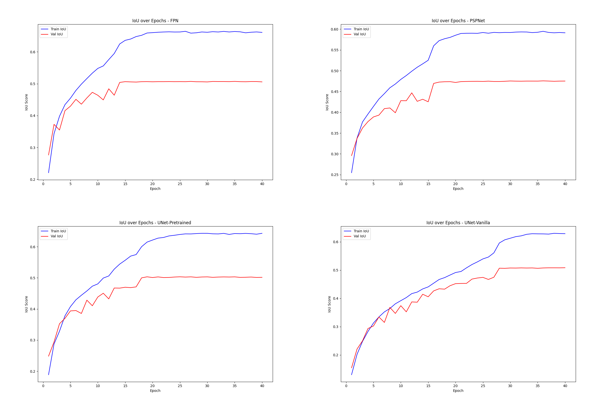
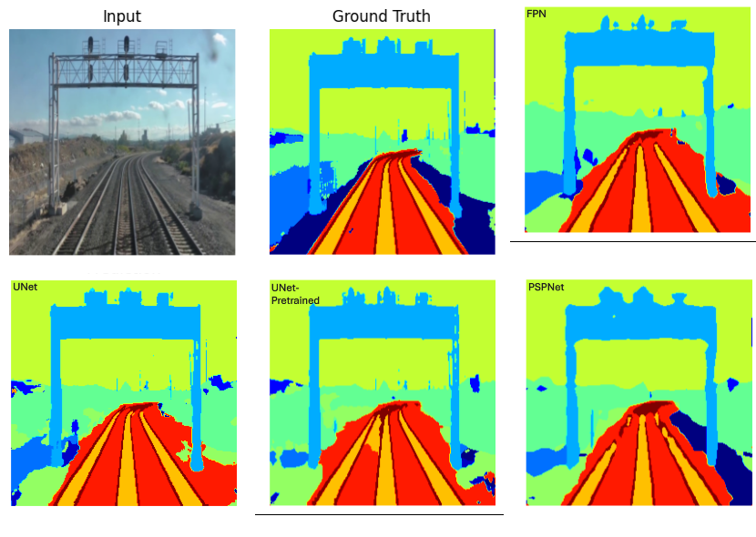

# RailAI-Vision: Deep Learning-Based Semantic Segmentation in Railway Environments

This module provides a comprehensive semantic segmentation pipeline for railway environments, using state-of-the-art architectures such as **U-Net**, **DeepLabV3+**, **FPN**, and **PSPNet**. It supports flexible training, validation, and inference on the **RailSem19** dataset using PyTorch and [segmentation_models.pytorch](https://github.com/qubvel-org/segmentation_models.pytorch).

---

## 📁 Folder Structure
```
segmentation/
├── configs/            # YAML config files for each model
├── datasets/           # Dataset loading and transformation logic
├── models/             # Model definitions
├── utils/              # Utilities and helpers
├── scripts/            # Training, evaluation, inference
│ ├── train.py
│ ├── evaluate.py
│ └── infer.py
├── weights/            # Trained model checkpoints
├── results/            # Logs, curves, predictions
├── requirements.txt    # Environment dependencies
└── README.md           # Documentation and usage guide
```

---
## ⚙️ Installation

```bash
cd segmentation
pip install -r requirements.txt
```

---

## 📚 Configuration
Each model uses its own YAML file inside configs/, defining:

- Model type
- Number of classes
- Pretrained status
- Image size, batch size, epochs, etc.
- Dataset paths
- Save path and output directory

📌 Example: configs/fpn.yaml

```yaml
model_name: "FPN"
num_classes: 19
in_channels: 3
image_size: [256, 256]
batch_size: 32
num_epochs: 40
learning_rate: 0.001
pretrained: true
ignore_index: 255

dataset_paths:
  image_dir: "/path/to/jpgs/rs19_val"
  mask_dir: "/path/to/uint8/rs19_val"
  split_file: "/path/to/splits/test.txt"

save_path: "weights/best_fpn.pth"
results_path: "results/fpn/"
```

---
## 🚀 Training
To train any model, use:
```bash
python scripts/train.py --config configs/<model_name>.yaml
```

📌 Example:
```bash
python scripts/train.py --config configs/deeplabv3plus.yaml
```

- Supports DataParallel and automatic GPU/CPU selection
- Tracks and saves best model based on validation IoU
- Plots training curves automatically

---

## 📈 Evaluation
Evaluate the model on validation/test splits:
```bash
python scripts/evaluate.py --config configs/<model_name>.yaml --split test
```
- Outputs accuracy, mean IoU, and per-class IoU
- Saves plots and confusion matrix to results/<model_name>/

---

## 🔍 Inference
To generate and visualize predictions:
```bash
python scripts/infer.py --config configs/<model_name>.yaml --output_dir results/<model_name>/predictions/
```
- Saves side-by-side visualizations of input, ground truth, and prediction

---

## 🧠 Supported Models
| Model Name      | Config File            | Backbone  | Pretrained |
| --------------- | ---------------------- | --------- | ---------- |
| UNet-Vanilla    | `unet_vanilla.yaml`    | Custom    | No         |
| UNet-Pretrained | `unet_pretrained.yaml` | ResNet-34 | Yes        |
| DeepLabV3+      | `deeplabv3plus.yaml`   | ResNet-50 | Yes        |
| FPN             | `fpn.yaml`             | ResNet-34 | Yes        |
| PSPNet          | `pspnet.yaml`          | ResNet-50 | Yes        |


---

## 📊 Dataset Format
Compatible with RailSem19, organized as:
```
/dataset_root/
├── jpgs/rs19_val/            # Input RGB images
├── uint8/rs19_val/           # Segmentation masks (uint8)
├── splits/
│   ├── train.txt
│   ├── val.txt
│   └── test.txt
```
- Each .txt file contains a list of image filenames (e.g., 123456.jpg) without paths.

---

## 📈 Output
Results are saved to:
```
results/<model_name>/
├── loss_<model_name>.png         # Training loss curve
├── acc_<model_name>.png          # Accuracy curve
├── iou_<model_name>.png          # IoU curve
├── test_vis_<model_name>.png     # Prediction visualizations
├── confusion_matrix.png          # Optional
```

Checkpoints are saved under:
```
weights/best_<model_name>.pth
```

### 🔎 Example Detection Output



---

## ✅ Features
- ⚙️ Modular YAML-based configuration
- 🧠 Multi-model support
- 📊 Live metric tracking (accuracy, IoU)
- 🧪 Reproducible evaluation
- 🖼️ High-quality visualizations
- 🔌 Plug-and-play dataset integration
- ✅ Supports CPU and GPU execution

---

## 📚 Acknowledgments
- [Segmentation Models PyTorch (SMP)](https://github.com/qubvel-org/segmentation_models.pytorch)
- [TorchVision Models](https://docs.pytorch.org/vision/main/models.html)
- [RailSem19 Dataset](https://www.wilddash.cc/railsem19)

---